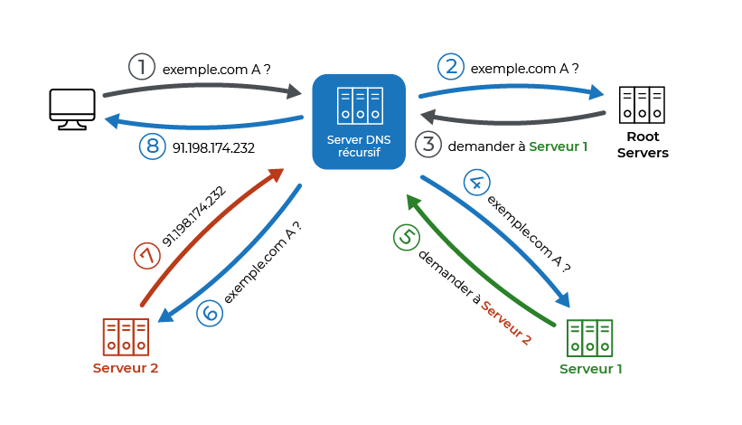

# Salut Tristan voila tes notes sur CI/CD

## Pour lancer le serveur de Vincent : ssh debian@46.105.146.175

## dockerfile
```yml
# We start for a docker image named "node:20-slim"
# see https://hub.docker.com/_/node
# We use base as an alias name
FROM node:20-slim AS base
# We'll work inside the directory /app
WORKDIR /app

######################################
# First stage (build the app)
FROM base as builder
# Copy project file
COPY . .
# Run npm install
# We use "npm ci" instead of "npm install"
# Read https://docs.npmjs.com/cli/v7/commands/npm-ci for explaination
RUN npm ci
# We run our custom build script
RUN npm run build

######################################
# Second stage (build the production container)
FROM base AS runner

RUN mkdir /app/db
VOLUME /app/db
RUN chown node:node /app/db
USER node
# Here we copy a file from "builder" stage to the current "runner" stage

COPY --from=builder /app/api /app/api
COPY --from=builder /app/data /app/data
COPY --from=builder /app/dist /app/dist
COPY --from=builder /app/node_modules /app/node_modules
COPY --from=builder /app/package.json /app/package.json
COPY --from=builder /app/js/words.js /app/js/words.js
COPY --from=builder /app/database.db /app/database.db

# The container will expose port 3000
EXPOSE 3000

# Start command to use for the conaitner
CMD node api/api.js
```
## Docker Compose
```yml

services:

  web:
    image: registry.minimmo.fr/tristan.chadeuf/hangman
    build: .

    ports:
      - 3000:3000

    volumes:
      - data:/app/db

volumes:
      data:

```
## .gitlab-ci.yml
```yml
# We use a pipeline with 2 stage
variables:
  DOCKER_HOST: tcp://docker:2376
  DOCKER_TLS_VERIFY: "true"
  DOCKER_TLS_CERTDIR: "/certs"
  DOCKER_CERT_PATH: "$DOCKER_TLS_CERTDIR/client"
  DOCKER_DRIVER: overlay2

stages:

  # the first stage>
  - test
  # the second stage>
  - build

  - deploy

vitest:
  image: node:20
  stage: test
  before_script:
    - npm ci
  script:
    - npm run test:ci
  artifacts:
    when: always
    reports:
      junit:
        - ./junit-report.xml

build:
  # We use the image named "docker" this image is usefull to run docker inside docker (aka DinD)
  # This is required because docker use docker image internally to build other docker image
  image: docker:24.0.5
  # We'll use the DinD service ,so we need to declare it
  # This service is installed on the Gitlab-Runner (The machine where your Jobs are executed)
  services:
    - docker:24.0.5-dind-rootless
  stage: build
  script:
    - echo "$CI_REGISTRY_PASSWORD" | docker login $CI_REGISTRY -u $CI_REGISTRY_USER --password-stdin
    - docker build -t registry.minimmo.fr/tristan.chadeuf/hangman .
    - docker push registry.minimmo.fr/tristan.chadeuf/hangman


deploy:
  stage: deploy
  when: always
  before_script:
    - install_packages openssh-client
    - eval $(ssh-agent -s)
    - echo "$SSH_PRIVATE_KEY" | tr -d '\r' | ssh-add -
    - mkdir -p ~/.ssh
    - chmod 700 ~/.ssh
    - ssh-keyscan 46.105.146.175 >> ~/.ssh/known_hosts
    - chmod 644 ~/.ssh/known_hosts

  script:
    - ssh debian@46.105.146.175 "docker pull registry.minimmo.fr/tristan.chadeuf/hangman"
    - ssh debian@46.105.146.175 "docker compose down"
    - ssh debian@46.105.146.175 "docker compose up -d"
```


## DNS




## Diagramme de déploiement

