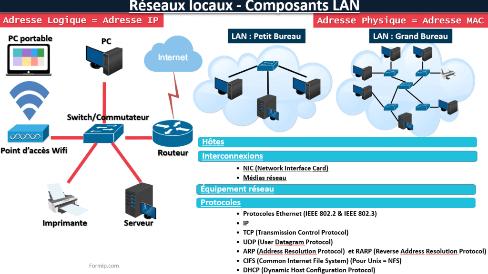
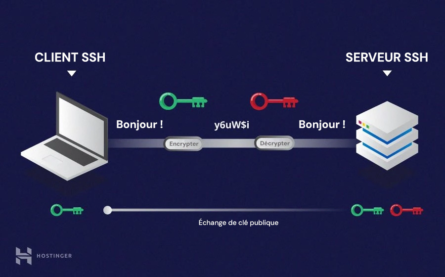

# Salut voila tes notes sur Reseaux et Systèmes

- Pour vous, qu’est ce qu’un réseau ?

Le réseau informatique désigne les appareils informatiques interconnectés qui peuvent échanger des données et partager des ressources entre eux. Ces appareils en réseau utilisent un système de règles, appelées protocoles de communication, pour transmettre des informations sur des technologies physiques ou sans fil.

- Quel est le lien entre la notion de réseau et Internet ?

Un réseau désigne un ensemble d'appareils connectés dans une zone limitée, comme une maison, un bureau ou un campus. En revanche, Internet est un réseau mondial de réseaux, qui s'étend sur toute la planète et connecte des milliards d'appareils situés dans divers endroits .

- Quelle est la différence entre Internet et le Web ? Ou a-t-il été inventé ?

Internet est une plateforme qui permet de faire parvenir des informations d'un ordinateur à un autre. Le web, lui, est un moyen de visiter des pages de sites à partir de navigateurs via des ordinateurs, des tablettes ou des smartphones.
Le web a été créér au CERN à Geneve.

# Quels sont les différents types de réseaux informatiques ? Pour chaque type de réseau, donner un exemple concret. 

## Le pan (Personal Area Network)

Le PAN permet d’échanger des données entre des appareils proches (généralement dans la même pièce). Pour ce faire, il existe 2 techniques de transmission physique, l’USB et le FireWire. Il est également possible de relier deux appareils via le WPAN (réseau personnel sans fil) avec des technologiques comme l’USB sans fil, le Bluetooth ou le Z-Wave.

Il est également possible de relier un réseau PAN vers d’autres réseaux plus grands. 

## Le lan (Local Area Network)
Si vous avez besoin de relier plusieurs ordinateurs sur un réseau, vous créez un LAN ou réseau local. Pour ce faire, nous utilisons le plus souvent le protocole Ethernet.

Pour connecter plus de 2 ordinateurs ensemble, il est nécessaire d’ajouter d’autres éléments, comme un hub ou un commutateur réseau. Ces éléments agissent comme des noeuds de distribution ou des éléments de couplage. 

Le LAN permet de transmettre une grande quantité de données rapidement. Celui-ci vous permet de partager des serveurs de fichiers, imprimantes ou encore des applications. 

Il est également possible de se connecter via le WLAN (Wireless Local Area Network) ou réseau local sans fil (Wifi). 

Bien que les deux solutions soient possibles, l’Ethernet offre plus de sécurité et un débit de données plus important.

## Le man (Metropolitan Area Network)
Le MAN permet de relier plusieurs LAN proches. Celui-ci permet d’échanger très rapidement des données entre différentes branches d’une société par exemple. En utilisant la fibre optique et des routeurs assez puissants, l’échange de données est plus rapide que via l’internet. 

## Le wan (Wide Area Network)
Le WAN permet de relier différentes machines très éloignées (à l’échelle d’un continent). Pour ce faire, le WAN se base sur les technologies des adresses IP, de SDH ou encore des ATM.

Les WAN sont souvent gérés par nos fournisseurs de services Internet. 

## Le gan (Global Area Network) 
Basiquement, internet est un GAN, un réseau mondial permettant d’échanger des informations entre différents appareils. Mais internet n’est pas le seul GAN. De nombreuses entreprises utilisent un GAN pour relier différents WAN ensemble. Les GAN utilisent des câbles sous marins et des transmissions par satellite.

## Les différents réseaux informatiques le VPN
Un VPN est un réseau de communication virtuel utilisant un réseau physique, mais éloigné de l’utilisateur. Cela permet de garantir une confidentialité des données échangées sur un serveur public comme internet. Sachant que seules les données ne sont pas visibles que par les autres utilisateurs du réseau, l’on parle de Tunneling entre les deux utilisateurs.

Ces sigles sont généralement utilisés par des informaticiens réseau, cependant, il est important de comprendre comment fonctionne l’échange de données au sein de son entreprise.

# Quels sont les principaux équipements physiques d’un réseau LAN ?

Les LAN connectés à Internet les plus simples n'ont besoin que d'un routeur et d'un moyen de connecter les appareils informatiques à celui-ci, par exemple des câbles Ethernet ou un hotspot WiFi.

# Qu’est ce que la commande ping ? A quoi sert-elle ?

La commande ping envoie une demande ECHO_REQUEST ICMP (protocole de message de gestion interréseau) pour recevoir une réponse ECHO RESPONSE ICMP d'un hôte ou d'une passerelle. La commande ping sert à : Déterminer l'état du réseau et de divers hôtes étrangers.

# Qu’est ce que TCP et IP ?

TCP/IP signifie Transmission Control Protocol/Internet Protocol (Protocol de contrôle des transmissions/Protocole Internet). TCP/IP est un ensemble de règles normalisées permettant aux ordinateurs de communiquer sur un réseau tel qu'Internet.

Décrivez les couches qui le composent
- Couche 1 : couche d'accès réseau. ...
- Couche 2 : couche Internet. ...
- Couche 3 : couche transport. ...
- Couche 4 : couche application.

Faites le lien avec le modèle OSI  :

Dans TCP/IP, cela fournit aux utilisateurs les normes physiques, les fonctions de transport, l'interface réseau et les fonctions de travail sur Internet qui correspondent aux trois premières couches du modèle OSI. En d'autres termes, dans le modèle TCP/IP, ces services sont tous effectués dans la couche application.

# Nom de domaine 
Faites une recherche sur les principes de base des noms de domaine afin de comprendre ce qu’est un sous-domaine : 

Un nom de domaine (souvent appelé simplement domaine) est un nom facilement mémorisable associé à une adresse IP physique sur Internet. Il s'agit du nom unique qui apparaît après le signe @ dans les adresses e-mail, et après www. dans les adresses Web. Par exemple, le nom de domaine example.com peut être associé à l'adresse physique 198.102.434.8. "google.com" et "wikipedia.org" sont deux autres exemples de noms de domaine.Le fait d'utiliser un nom de domaine, plutôt qu'une adresse IP numérique, pour identifier un emplacement sur Internet facilite grandement la mémorisation et la saisie des adresses Web.

Tout le monde peut acheter un nom de domaine. Il suffit de faire appel à un hébergeur de domaine ou à un bureau d'enregistrement de noms de domaine, de trouver un nom qui n'est utilisé par personne d'autre et de payer les frais annuels modiques qui s'appliquent.

Lorsque vous vous inscrivez aux services Google Cloud, vous indiquez le nom de domaine avec lequel vous souhaitez les utiliser. Ce doit être un domaine dont vous êtes propriétaire, et nous vous demanderons d'en valider la propriété. Nous pouvons aussi vous aider à en acheter un.

# Une explication des différents types d’enregistrement DNS

Les enregistrements PTR sont utilisés dans le cadre des recherches DNS inversées. Alors que les enregistrements de type A et AAAA permettent de mapper des FQDN à des adresses IP, les enregistrements PTR font le contraire : ils mappent les adresses IP aux noms de domaine.

# Qu’est ce qu’une API (et plus spécifiquement une API REST)?

Une API REST (également appelée API RESTful) est une interface de programmation d'application (API ou API web) qui respecte les contraintes du style d'architecture REST et permet d'interagir avec les services web RESTful.

# Qu’est ce que le protocole HTTP ?

L’Hypertext Transfer Protocol, généralement abrégé HTTP, littéralement « protocole de transfert hypertexte », est un protocole de communication client-serveur développé pour le World Wide Web. HTTPS est la variante sécurisée par le chiffrement et l'authentification.

# Quelles sont les méthodes disponibles avec le protocole HTTP ?

Il existe de nombreuses méthodes, les plus courantes étant GET, HEAD et POST : GET. C'est la méthode la plus courante pour demander une ressource. Une requête GET est sans effet sur la ressource, il doit être possible de répéter la requête sans effet.

# Quelle est la différence entre le protocole HTTP et le protocole HTTPS ?

Le protocole HTTP transmet des données non chiffrées, ce qui signifie que les informations envoyées depuis un navigateur peuvent être interceptées et lues par des tiers. Ce processus n'étant pas idéal, il a été étendu au protocole HTTPS pour ajouter une couche de sécurité supplémentaire aux communications.

# Qu’est ce qu’un Bearer token ?

L'authentification du porteur (Bearer), également connue sous le nom d'authentification basée sur les jetons, est une méthode d'authentification des utilisateurs en passant un jeton d'accès (également appelé « jeton du porteur ») dans les en-têtes de requête.

# Quels sont les protocoles qui ont été remplacés par SSH ?

SSH doit être utilisé en lieu et place de protocoles historiques (TELNET, RSH, RLOGIN) pour des accès shell distants. Les serveurs d'accès distants TELNET, RSH, RLOGIN doivent être desinstallés du système.

# Quelles sont les différents modes d’utilisation de SSH (notamment au niveau de la sécurité)?

En général, deux méthodes d'authentification SSH sont largement utilisées: l'authentification par mot de passe et l'authentification par clé publique ( PKI ).

## Quelles sont les problématiques qui vont survenir par rapport à la gestion des différents code source (notamment par rapport à la diversité des technologies)?

Le problème de cette méthode et qu'il faut tout changer à chaque changement le déploiement

# Comment configurer un serveur web

Guide d’intallation : https://www.digitalocean.com/community/tutorials/how-to-install-linux-nginx-mysql-php-lemp-stack-on-ubuntu-20-04-fr

## Pour mettre le cryptage SSL
Voici un tutorial interessant et complet : https://www.digitalocean.com/community/tutorials/how-to-secure-nginx-with-let-s-encrypt-on-ubuntu-20-04-fr

# Docker

Les avantages de la conteneurisation :

### Portabilité

Un conteneur d'application crée un progiciel exécutable qui est isolé par rapport au système d'exploitation hôte. Ainsi, il ne dépend pas du système d'exploitation hôte et n'est pas lié à celui-ci, ce qui le rend portable et lui permet de s'exécuter de manière cohérente et uniforme sur n'importe quelle plate-forme ou cloud. Les méthodes de consolidation du système d'exploitation utilisées par les développeurs permettent également d'éviter les incohérences telles que l'intégration qui cherche à entraver la fonctionnalité de l'application.

### Vitesse

Les développeurs désignent les conteneurs comme « légers » parce qu'ils partagent le noyau du système d'exploitation de la machine hôte et qu'ils ne font pas l'objet de charges supplémentaires. Leur légèreté permet d'améliorer l'efficacité des serveurs et de réduire les coûts liés aux serveurs et aux licences. Elle réduit également le temps de lancement, car il n'y a pas de système d'exploitation à démarrer.

L'utilisation d'un conteneur Docker vous permet de créer une version principale d'une application (image) et de la déployer rapidement sur demande. Un environnement conteneur garantit une grande flexibilité lorsque vous souhaitez créer plusieurs nouvelles instances conteneurisées d'applications à la demande.

### Évolutivité

La technologie des conteneurs d'applications offre une grande évolutivité. Un conteneur d'application peut gérer des charges de travail croissantes en reconfigurant l'architecture existante afin d'activer les ressources à l'aide d'une conception d'application orientée vers les services. Par ailleurs, un développeur peut ajouter d'autres conteneurs dans un cluster d'ordinateurs distribués.

Un environnement conteneur permet l'ajout de nouvelles fonctions, mises à jour et caractéristiques instantanément sans que cela affecte les applications d'origine. Par conséquent, les conteneurs permettent l'évolutivité des applications avec une utilisation des ressources minimale.

### Agilité

Le Docker Engine, qui permet l'exécution des conteneurs, est devenu la norme de l'industrie en matière de conteneurs d'applications grâce à des outils de développement simples et à une approche universelle fonctionnant avec les systèmes d'exploitation Windows et Linux. Cet écosystème de conteneurs est désormais passé aux moteurs sous la direction de l'OCI (Open Container Initiative). Les développeurs peuvent donc continuer à utiliser les outils et les processus DevOps pour accélérer le développement et l'amélioration des applications.

### Efficacité

Étant donné que les logiciels exécutés dans les environnements conteneurisés partagent le noyau du système d'exploitation de la machine hôte, les développeurs peuvent partager les couches d'application entre les conteneurs. De plus, les conteneurs ont une capacité intrinsèquement plus petite que les machines virtuelles. Leur temps de démarrage est réduit, ce qui permet aux développeurs d'exécuter plus de conteneurs sur la même capacité de calcul qu'une machine virtuelle unique. Ainsi, l'efficacité des serveurs est augmentée et les coûts des serveurs et des licences sont réduits.

### Mauvaise isolation

La conteneurisation d'une application permet de l'isoler et de la faire fonctionner de façon indépendante. Par conséquent, la défaillance d'un conteneur n'affecte pas le fonctionnement des autres. Les équipes de développement peuvent rapidement identifier et corriger les problèmes techniques d'un conteneur défectueux sans provoquer l'arrêt du reste des conteneurs. En outre, le moteur de conteneur peut tirer parti de techniques d'isolation de la sécurité du système d'exploitation comme le contrôle d'accès SELinux pour identifier et isoler les pannes au sein des conteneurs.

### Sécurité

L'isolation des applications via les conteneurs empêchent le code malveillant d'affecter d'autres applications conteneurisées ou le système hôte. Vous pouvez également définir des autorisations de sécurité pour bloquer automatiquement l'accès aux composants indésirables qui cherchent à s'introduire dans d'autres conteneurs ou à limiter les communications.

L'isolation des applications aide les développeurs à partager des fonctionnalités supplémentaires sans facteur de risque. Par exemple, si vous travaillez avec une équipe de développement à l'extérieur de votre réseau, vous pouvez partager les ressources nécessaires sans que les informations critiques ne se trouvent dans votre réseau.

### Facilité de la gestion

En utilisant une plate-forme d'orchestration des conteneurs, vous pouvez automatiser l'installation, la gestion et l'évolution des charges de travail et des services conteneurisés. L'orchestration des conteneurs permet de faciliter les tâches de gestion, comme le déploiement de nouvelles versions d'applications, l'évolution d'applications conteneurisées ou la mise à disposition de fonctions de surveillance, de consignation et de débogage.

### Continuité

Différents conteneurs s'exécutent indépendamment, de sorte que la défaillance de l'un n'aura pas d'impact sur la continuité des autres. Les équipes de développement bénéficient de la flexibilité nécessaire à la correction des erreurs dans un conteneur sans provoquer l'arrêt des autres. Par conséquent, la conteneurisation assure la continuité des opérations.

### Facilité d'utilisation pour les développeurs

Les conteneurs sont conviviaux pour les développeurs, car il est possible d'utiliser un seul environnement pour le développement et la production, un obstacle courant dans le développement d'applications web. Votre équipe de développement peut écrire une app sur un ordinateur portable Windows, mais celle-ci ne s'exécute pas sur un poste de travail Mac.

Avec la conteneurisation, l'image que votre équipe construit localement est la même que celle exécutée en production. Lorsqu'elles sont combinées à un workflow approprié, les applications conteneurisées peuvent aider à minimiser les cas où elles fonctionnent correctement à un emplacement, mais elles s'exécutent avec bogues dans un autre. De plus, les workflow de construction de conteneurs fonctionnent exceptionnellement bien dans les intégrations de pipelines CI/CD. Ces avantages permettent à votre équipe de développement de gagner en productivité et en efficacité.

### Quelle est la différence entre une image Docker et un conteneur ?
Si on etait enobjet il faut imaginer que le conteneur est un objet et une image une classe

### Que fait Docker si l’image demandée n’est pas présente localement?

l'image sera télécharger directement sur internet

## Les volumes avec docker

Un volume standard dans Docker est un répertoire (ou un système de fichiers) dans l'hôte qui est géré par Docker. Il est isolé de la structure du système de fichiers de l'hôte et du cycle de vie des conteneurs.

exemple d'un lancement de container avec un volume :

sudo docker run --detach -v my-vol  --name some-mariadb --env MARIADB_ROOT_PASSWORD=root  mariadb:latest 

## Stateless et stateful

- Stateless

Un processus ou une application stateless est indépendant. Il ne stocke pas de données et ne fait référence à aucune transaction passée. Chaque transaction est effectuée à partir de rien, comme si c'était la première fois. Les applications stateless fournissent un service ou une fonction et utilisent un réseau de diffusion de contenu, le web ou des serveurs d'impression pour traiter ces requêtes à court terme. 

Par exemple, une recherche en ligne pour répondre à une question quelconque est une transaction stateless. Vous tapez votre question dans le moteur de recherche et appuyez sur Entrée. Si votre transaction est accidentellement interrompue ou fermée, vous devez en démarrer une nouvelle. Les transactions stateless sont comparables à des distributeurs automatiques : une seule requête et une seule réponse. 

- Stateful
Les applications et processus stateful, quant à eux, peuvent être réutilisés indéfiniment. Les plateformes bancaires en ligne et les messageries en sont deux exemples. Les transactions précédentes sont prises en compte et peuvent affecter la transaction actuelle. C'est pour cela que les applications stateful utilisent les mêmes serveurs chaque fois qu'elles traitent une requête d'un utilisateur.  

Si une transaction stateful est interrompue, le contexte et l'historique sont stockés et vous pouvez ainsi reprendre là où vous en étiez. Les applications stateful gardent une trace de divers éléments, comme l'URL de la page, les paramètres de préférence et l'activité récente. Les transactions stateful sont comparables à une conversation continue et périodique avec la même personne.

La majorité des applications que nous utilisons au quotidien sont des applications stateful. Toutefois, les technologies évoluent et les microservices ainsi que les conteneurs facilitent le développement et le déploiement d'applications dans le cloud. 

