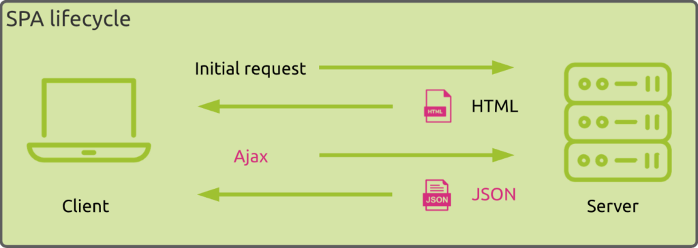

# Salut voila tes notes sur SPA

## Préambule

Quand et pourquoi ce type d'applications a vu le jour ? 

Une application à page unique est une application qui interagit avec les utilisateurs en réécrivant les pages Web existantes avec de nouvelles données provenant du serveur Web, au lieu d’utiliser la technique par défaut du navigateur qui exécute une toute nouvelle page.

L'objectif est d'avoir des transitions plus rapides qui peuvent faire en sorte que le site se sente plus comme une application inhérente.

Quels sont les avantages et inconvénients de cette approche ?

Avantages : c'est simple à réaliser. 

Inconvénients : - Vous n'avez qu'une seule page d'un point de vue SEO, c'est limité. - Vous devez charger pas mal de choses au démarrage ce qui pénalise la rapidité du site

Quels sont les principaux frameworks utilisés pour développer des "SPA" de nos jours ?

Angular
Angular (ou Angular 2+) date de 2014. Il a été développé par Google et est une réécriture complète en Typescript du framework AngularJS dont la première version date de 2010.

Angular propose une approche modulaire orientée composant basée sur un modèle MVVM (Model–view–viewmodel).

React
React (ou ReactJS) date de 2013 et a été développée en Javascript par Facebook.

React est comme Angular orienté composant mais s’apparente plus à une bibliothèque qu’à un framework et n’adresse que la vue du MVVM (Model–view–viewmodel)

Vue
Vue (ou Vue.js) date de 2014 et a été développée en Javascript par Evan You un ancien ingénieur de Google. Contrairement à Angular et React qui sont portés respectivement par des entreprises, Vue est indépendant et piloté par la communauté.

Comme React, Vue propose une approche modulaire de type bibliothèque orientée composant.

## Information sur certain Framework SPA

### Angular 

Date de création : 14 septembre 2016

Communauté / entreprise assurant le développement : 	Google et la communauté Angular.

License : Copyright (c) 2010-2024 Google LLC. https://angular.io/license

Points forts : Il est connu pour ses performances, son évolutivité et ses fonctionnalités élevées .

Points faibles : Angular présente également certains inconvénients, tels que sa complexité et sa courbe d'apprentissage. Avant d'utiliser Angular dans votre prochain projet, il est important de peser soigneusement le pour et le contre.

###  React 

Date de création : 29 mai 2013

Communauté / entreprise assurant le développement : Meta Platforms

License : Licence MIT

Points forts : L'un des principaux avantages de React est qu'il vous permet de créer des interfaces utilisateur dynamiques et interactives avec une grande facilité. Vous pouvez créer des composants réutilisables et les assembler pour créer des applications complexes.

Points faibles : En effet, l'environnement change très rapidement ce qui oblige les développeurs à réapprendre les codes. Le rythme, les habitudes, les méthodes changent constamment, ainsi, ils doivent constamment s'informer des changements.

### Vue

Date de création : 11 fevrier 2014

Communauté / entreprise assurant le développement : Evan You (尤雨溪)

License : Licence MIT

Points forts : Flexibilité : le framework s’exécute directement depuis le navigateur ce qui facilite le processus de test ;
Légèreté : les applications conçues avec Vue sont ultras légères et pèsent entre 18 et 21 Ko ;
Rapidité : conséquence de la légèreté de son code, les applications s’exécutent rapidement ;
Une courbe d’apprentissage aisée : considéré comme facile à apprendre, sa prise en main s’avère rapide pour un développeur connaissant déjà le JavaScript dont vous pouvez apprendre ses rouages via nos formations JavaScript ;
Une vaste communauté indirecte : s’appuyant sur le langage JavaScript, il bénéficie par extension, de sa large communauté qui permettra de résoudre la plupart des problèmes rencontrés lors de la conception d’une application ;
Une syntaxe performante : son code se veut ultra concis et simple ;
Polyvalence : Vue peut s’utiliser de différentes manières plus ou moins poussées : création d’un widget qui s’intégrera à une page comme le ferait un plugin JQuery, réalisation d’une application monopage, création de composants, d’applications complexes disposant de routing et utilisant une API… tout est possible comme le fait de pouvoir utiliser des templates HTML directement de le DOM ou encore déclarer des templates inline, packager un template avec son composant dans un fichier .vue, etc. Vue s’adapte aux besoins !
Une intégration à Symfony : Vue s’intègre parfaitement avec Symfony. Il est possible d’avoir des templates Vue et Twig, de les mélanger entre eux, d’intégrer des composants, de relier une application Vue sur un template ou un formulaire Symfony ;

Points faibles : Une stabilité hasardeuse : bien que des efforts fussent faits pour améliorer la stabilité du framework, les applications conçues avec ne sont pas toujours réputées pour leur stabilité, surtout si elles sont complexes. Il conviendra à des projets personnels simples, pour ceux plus aboutis, il faudra se tourner vers d’autres technologies comme React ;
Une évolutivité perfectible : relativement jeune et open source, Vue est également un framework indépendant qui se concentre principalement sur les applications Web simples et légères ainsi que la création d’interfaces utilisateurs. Il ne dispose pas autant d’extensions que certains frameworks ce qui le limite dans ses possibilités ;
Une communauté restreinte : conséquence directe de sa jeunesse, sa communauté s’avère assez réduite et s’avère principalement anglophone.

