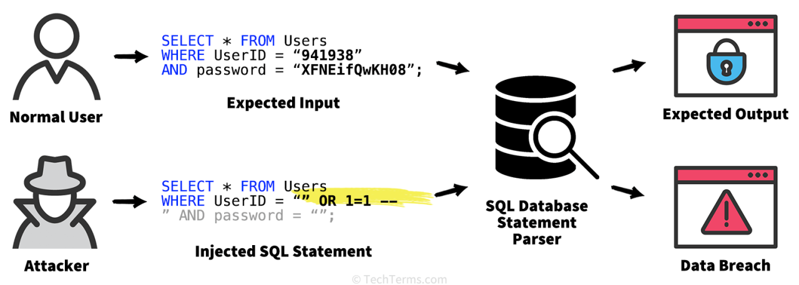
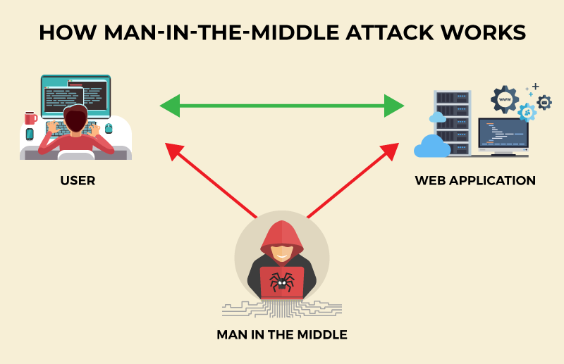

# Cybersécurité

La cybersécurité est la pratique consistant à protéger les systèmes, les réseaux et les programmes contre les attaques numériques. Ces cyberattaques visent généralement à accéder à des informations sensibles, à les modifier ou à les détruire, à extorquer de l'argent aux utilisateurs, ou à interrompre les processus normaux de l'entreprise.

## Les diffférentes types d'attaque 

- Le phishing :

Le phishing est la pratique consistant à envoyer des e-mails frauduleux qui ressemblent à des e-mails provenant de sources fiables. L'objectif est de voler des données sensibles telles que des numéros de carte bancaire et des informations de connexion. C'est le type de cyberattaque le plus courant. Vous pouvez vous protéger grâce à l'éducation ou à une solution technologique qui filtre les e-mails malveillants.

- Les ransomwares :

Les ransomwares constituent un type de logiciel malveillant. Ils sont conçus pour extorquer de l'argent en bloquant l'accès aux fichiers ou au système informatique jusqu'à ce que la rançon soit payée. Le paiement de la rançon ne garantit pas que les fichiers seront récupérés ou le système restauré.

- Le malware : 

Le programme malveillant est un type de logiciel qui permet d'obtenir un accès non autorisé ou de causer des dommages à un ordinateur. 

- L'ingénierie sociale : 

L'ingénierie sociale est une tactique que les hackers utilisent pour vous inciter à révéler des informations sensibles. Ils peuvent solliciter un paiement ou accéder à vos données confidentielles. L'ingénierie sociale peut être combinée à l'une des menaces répertoriées ci-dessus pour vous rendre plus susceptibles de cliquer sur des liens, de télécharger des malwares ou de faire confiance à une source malveillante.

## Types de logiciels malveillants

Malware |Différents|
| - | - | ''
| Les logiciels publicitaires  | logiciels indésirables conçus pour afficher des publicités sur votre écran, le plus souvent dans un navigateur Web. En règle générale, il utilise une méthode sournoise pour se faire passer pour légitime ou pour s'appuyer sur un autre programme pour vous inciter à l'installer sur votre PC, votre tablette ou votre appareil mobile.|
| Les logiciels espions |  sont des logiciels malveillants qui observent secrètement les activités de l'utilisateur de l'ordinateur sans autorisation et les signalent à l'auteur du logiciel.|
 | virus | Un  virus  est un logiciel malveillant qui s'attache à un autre programme et, lorsqu'il est exécuté (généralement par inadvertance par l'utilisateur), se réplique en modifiant d'autres programmes informatiques et en les infectant avec ses propres morceaux de code.
 |vers |Les vers  sont un type de malware similaire aux virus. Comme les virus, les vers se reproduisent automatiquement. La grande différence est que les vers peuvent se propager d'eux-mêmes à travers les systèmes, alors que les virus nécessitent une certaine action de la part de l'utilisateur pour lancer l'infection.|
 |cheval de Troie|Un  cheval de Troie , ou cheval de Troie, est l'un des types de logiciels malveillants les plus dangereux. Il se présente généralement comme quelque chose d’utile pour vous tromper. Une fois installé sur votre système, les attaquants derrière le cheval de Troie obtiennent un accès non autorisé à l'ordinateur concerné. À partir de là, les chevaux de Troie peuvent être utilisés pour voler des informations financières ou installer d’autres formes de logiciels malveillants, souvent des ransomwares.|
 |ransomware  |Un ransomware  est une forme de malware qui vous empêche d'accéder à votre appareil et/ou crypte vos fichiers, puis vous oblige à payer une rançon pour y accéder à nouveau. Les ransomwares sont considérés comme l'arme de prédilection des cybercriminels car ils exigent un paiement rapide et rentable en cryptomonnaie difficile à retracer  . Le code derrière les ransomwares est facile à obtenir sur les marchés criminels en ligne et il est très difficile de s’en défendre. Alors que les attaques de ransomware contre les consommateurs individuels sont actuellement en baisse, les attaques contre les entreprises ont augmenté de 365 % en 2019. À titre d'exemple, le  ransomware Ryuk  cible spécifiquement les organisations de premier plan qui sont plus susceptibles de payer des rançons importantes. Pour en savoir plus, consultez la  rétrospective Malwarebytes Labs Ransomware .|
 |Rootkit|Rootkit  est une forme de malware qui fournit à l'attaquant des privilèges d'administrateur sur le système infecté, également appelés accès « root ». En règle générale, il est également conçu pour rester caché à l'utilisateur, aux autres logiciels du système et au système d'exploitation lui-même.|
 |Un  keylogger  |Un  keylogger  est un logiciel malveillant qui enregistre toutes les frappes de l'utilisateur sur le clavier, stockant généralement les informations collectées et les envoyant à l'attaquant, qui recherche des informations sensibles telles que des noms d'utilisateur, des mots de passe ou des détails de carte de crédit.
|Le cryptomining malveillant|Le cryptomining malveillant , également parfois appelé drive-by mining ou  cryptojacking , est un malware de plus en plus répandu, généralement installé par un cheval de Troie. Il permet à quelqu’un d’autre d’utiliser votre ordinateur pour extraire des crypto-monnaies comme Bitcoin ou Monero. Ainsi, au lieu de vous permettre de tirer profit de la puissance de votre propre ordinateur, les cryptomineurs envoient les pièces collectées sur leur propre compte et non sur le vôtre. Essentiellement, un cryptomineur malveillant vole vos ressources pour gagner de l’argent.|
|Les exploits |Les exploits  sont un type de malware qui profite des bogues et  des vulnérabilités  d'un système afin de permettre à l'attaquant d'accéder à votre système. Une fois sur place, l'attaquant peut voler vos données ou déposer une forme de logiciel malveillant. Un exploit zero-day fait référence à une vulnérabilité logicielle pour laquelle il n’existe actuellement aucune défense ou correctif disponible.|

## différentes types d'attaque

### DDOS

Dans le cadre d'une attaque par déni de service distribué (DDoS), un type de cyberattaque, un attaquant submerge un site Web, un serveur ou une ressource réseau avec du trafic malveillant. En conséquence, la cible tombe en panne ou cesse de fonctionner, refusant le service aux utilisateurs légitimes et empêchant le trafic légitime d'arriver à destination.

D'un point de vue général, une attaque DDoS ou DoS est comme un embouteillage inattendu causé par des centaines de fausses demandes de covoiturage. Les demandes semblent légitimes pour les services de covoiturage, ils envoient donc des chauffeurs pour récupérer les passagers, ce qui encombre inévitablement les rues de la ville. Le trafic légitime ordinaire est alors entravé et les personnes ne peuvent pas arriver à destination.

### Injection SQL

L'injection SQL est une technique permettant d'injecter des éléments, notamment du code de type SQL (Structured Query Language, langage utilisé pour manipuler les bases de données), dans les champs des formulaires web ou dans les liens des pages afin de les envoyer au serveur web.

### Cross-site scripting

Le cross-site scripting (abrégé XSS) est un type de faille de sécurité des sites web permettant d'injecter du contenu dans une page, provoquant ainsi des actions sur les navigateurs web visitant la page. Les possibilités des XSS sont très larges puisque l'attaquant peut utiliser tous les langages pris en charge par le navigateur (JavaScript, Java...) et de nouvelles possibilités sont régulièrement découvertes notamment avec l'arrivée de nouvelles technologies comme HTML5. Il est par exemple possible de rediriger vers un autre site pour de l'hameçonnage ou encore de voler la session en récupérant les cookies.

Le cross-site scripting est abrégé XSS pour ne pas être confondu avec le CSS (feuilles de style)1, X se lisant « cross » (croix, à travers) en anglais.

###  Man-in-the-Middle

Lorsque vous essayez d'accéder à une page web, les informations voyagent du serveur à votre ordinateur via une super-autoroute de câbles, de routeurs et de commutateurs informatiques qui étendent l'internet à travers le monde. Comme les voleurs d'autoroutes d'autrefois, les attaquants modernes savent que vous êtes vulnérable à chaque "carrefour". C'est à ces endroits que vos données peuvent être interceptées, lues et même modifiées. Une attaque man-in-the-middle est une procédure qui permet à un attaquant de s'interposer entre vous et l'ordinateur avec lequel vous communiquez pour lire la conversation ou la modifier. Cette procédure était extrêmement courante avant le passage massif à HTTP-Secure et elle l'est toujours aujourd'hui, même si elle est un peu plus compliquée à réaliser.

